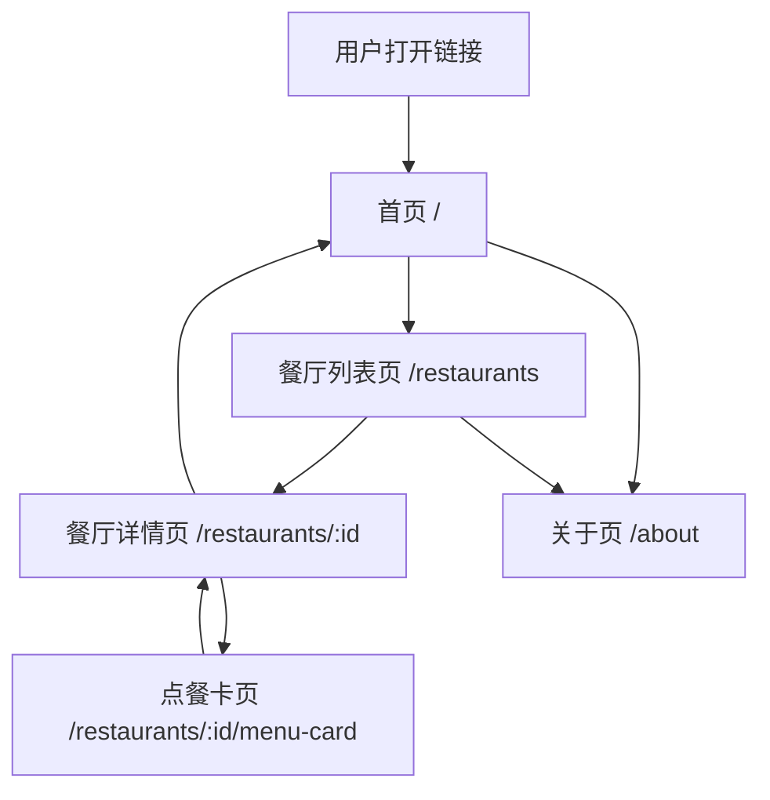

# 产品需求规格说明书 PRD V1.0
更新时间：2026-05-21
更新人：产品架构师
适用范围：前端研发、后端研发、UI设计师

| 版本号 | 更新时间 | 更新内容 | 更新人 |
|--------|----------|----------|--------|
| V1.0 | 2026-05-21 | 初始版本创建 | 产品架构师 |

---

## 核心结论
本产品共 **5 个页面**，无登录，所有数据来自 Convex 静态后端，地图调用高德 AMAP JS API。研发拿到此文档可直接写代码，零追问。

---

## 一、页面流程图（Mermaid）



---

## 二、信息架构

```
VeganEats China
├── 首页（/）
│   ├── Hero 区：标语 + CTA 按钮
│   ├── 活动说明条（muShanghai 时间/地点）
│   └── 快速入口（Find Restaurants）
├── 餐厅列表页（/restaurants）
│   ├── 筛选栏（素食类型 tag）
│   ├── 餐厅卡片列表（距离排序）
│   └── 地图入口按钮（跳高德）
├── 餐厅详情页（/restaurants/:id）
│   ├── 餐厅基本信息
│   ├── 高德地图小图（静态图）+ 导航按钮
│   ├── 营业时间 / 价格区间
│   └── 进入点餐卡按钮
├── 点餐卡页（/restaurants/:id/menu-card）
│   ├── 菜品卡片列表（英文说明 + 中文展示）
│   └── 返回餐厅详情
└── 关于页（/about）
    ├── 项目介绍（muShanghai & VeganEats）
    ├── 数据说明（最后更新时间）
    └── 反馈入口（邮件链接）
```

---

## 三、功能优先级

| 功能 | 优先级 | 页面 | 说明 |
|------|--------|------|------|
| 餐厅列表展示 | P0 | /restaurants | 核心功能，必须上线 |
| 餐厅详情 | P0 | /restaurants/:id | 核心功能 |
| 点餐卡 | P0 | /restaurants/:id/menu-card | 核心差异化功能 |
| 高德地图导航入口 | P0 | 详情页 | 直接跳高德App/网页 |
| 素食类型筛选 | P0 | 列表页 | Vegan/Vegetarian/Gluten-free |
| 匿名PV统计 | P0 | 全局 | Vercel Analytics（内置，零配置）|
| 收藏功能 | P1 | 列表/详情 | LocalStorage，时间不够可砍 |
| 餐厅建议提交 | P1 | 关于页 | 表单，时间不够用邮件链接代替 |

---

## 四、页面详细需求

---

### 页面 1：首页

**基本信息**
- 页面名称：Home
- URL：`/`
- 入口：直接访问域名根路径

**页面元素**

| 区块 | 元素 | 内容/说明 |
|------|------|-----------|
| 顶部导航 | Logo文字 | "VeganEats" 左对齐，点击返回首页 |
| 顶部导航 | About链接 | 右对齐，跳转 /about |
| Hero区 | 主标题 H1 | "Eat Well in Shanghai" |
| Hero区 | 副标题 | "Vegan & vegetarian restaurants near muShanghai, Hongqiao" |
| Hero区 | CTA按钮 | "Find Restaurants →"，点击跳转 /restaurants |
| 活动说明条 | 文字 | "📅 May 10 – Jun 6, 2026 · Alibaba Hongqiao Center" |
| 活动说明条 | 图标 | 地图pin图标 + 素食叶子图标（SVG内联，无外部依赖）|
| 底部 | 版权 | "© 2026 VeganEats China · Made for muShanghai" |

**交互逻辑**
- CTA按钮点击 → 跳转 /restaurants（Next.js Link，无reload）
- About链接点击 → 跳转 /about
- 页面无下拉加载，全静态渲染（Next.js SSG）

**异常状态**
- 无网络：页面静态渲染，正常显示（无数据依赖）

**数据来源**
- 无 Convex 调用，纯静态内容

**技术备注**
- Next.js SSG（`getStaticProps` 或 App Router 静态页）
- 无高德 API 调用
- 无 LocalStorage 操作

**设计备注**
- 背景色：`#F7F5F0`（米白，温暖自然感）
- Hero区：垂直居中，padding-top: 72px，padding-bottom: 48px
- CTA按钮：`#2D6A4F`（深绿）背景，白色文字，border-radius: 12px，height: 52px，full-width on mobile
- 字体：系统无衬线（-apple-system, BlinkMacSystemFont, "Segoe UI", sans-serif）
- 活动说明条：`#EAF4EE` 背景，`#2D6A4F` 文字，border-radius: 8px，margin: 16px

---

### 页面 2：餐厅列表页

**基本信息**
- 页面名称：Restaurant List
- URL：`/restaurants`
- 入口：首页CTA按钮 / 顶部导航

**页面元素**

| 区块 | 元素 | 内容/说明 |
|------|------|-----------|
| 顶部 | 页面标题 | "Restaurants near muShanghai" |
| 顶部 | 副标题 | "Within 15 min walk · [餐厅总数] places" |
| 筛选栏 | Tag筛选 | "All" / "Vegan" / "Vegetarian" / "Gluten-free" |
| 筛选栏 | 位置 | 水平滚动，单选，默认选中"All" |
| 餐厅卡片 | 餐厅名 | 英文名（加粗）+ 中文名（次级，灰色）|
| 餐厅卡片 | 标签 | Vegan/Vegetarian/Gluten-friendly 彩色tag |
| 餐厅卡片 | 步行时间 | "🚶 8 min"（基于直线距离估算，非实时）|
| 餐厅卡片 | 价格区间 | "¥" / "¥¥" / "¥¥¥" |
| 餐厅卡片 | 营业状态 | "Open Now" / "Check hours"（仅静态标注，非实时）|
| 餐厅卡片 | 箭头 | 右侧"›"，点击整卡片跳转详情 |
| 列表底部 | 说明文字 | "Data last verified: [日期]" |

**交互逻辑**
- 筛选Tag点击：过滤列表，仅前端JS过滤，无网络请求
- 餐厅卡片点击：整卡片可点击，跳转 `/restaurants/:id`
- 默认排序：按步行距离升序
- 列表加载：骨架屏（Skeleton）过渡，Convex 查询返回前显示3个骨架卡片
- 下拉刷新：不支持（静态数据无需刷新）

**异常状态**
- Convex 加载失败：显示"Unable to load restaurants. Please check your connection."，提供重试按钮
- 筛选结果为空：显示"No restaurants match this filter."

**数据来源**
- Convex 表：`restaurants`
- 字段：`id`, `name_en`, `name_zh`, `tags[]`, `walk_minutes`, `price_level`, `is_open_static`, `verified_date`
- 查询：`api.restaurants.list`（无参数，返回全部，前端筛选）

**技术备注**
- 高德 API：不调用（列表页无地图）
- LocalStorage：筛选状态不持久化（刷新重置，符合无状态原则）
- Convex 查询用 `useQuery` hook，自动实时更新（静态数据变更后自动推送）

**设计备注**
- 筛选Tag：选中态 `#2D6A4F` 背景白字；未选中 `#F0F0F0` 背景深灰字；border-radius: 20px；height: 32px；padding: 0 12px
- 卡片：白色背景，border-radius: 12px，padding: 16px，margin-bottom: 12px，box-shadow: 0 1px 4px rgba(0,0,0,0.08)
- Vegan tag颜色：`#D4EDDA` 背景 `#155724` 文字
- Vegetarian tag颜色：`#CCE5FF` 背景 `#004085` 文字
- Gluten-free tag颜色：`#FFF3CD` 背景 `#856404` 文字
- 步行时间：`#666` 灰色，font-size: 13px

---

### 页面 3：餐厅详情页

**基本信息**
- 页面名称：Restaurant Detail
- URL：`/restaurants/:id`（如 `/restaurants/greenwave-kitchen`）
- 入口：餐厅列表页卡片点击

**页面元素**

| 区块 | 元素 | 内容/说明 |
|------|------|-----------|
| 顶部 | 返回按钮 | "← Restaurants"，返回列表页 |
| 餐厅头部 | 餐厅英文名 | H1，加粗 |
| 餐厅头部 | 中文名 | H2，次级，灰色 |
| 餐厅头部 | 标签组 | 同列表页tag样式 |
| 地图区块 | 高德静态地图 | 宽度100%，高度160px，显示餐厅位置pin |
| 地图区块 | 导航按钮 | "Navigate with Amap →"（跳转高德App/网页）|
| 信息区块 | 地址 | 中英文地址，可长按复制 |
| 信息区块 | 步行说明 | "🚶 约X分钟步行（from Alibaba Hongqiao Center）"|
| 信息区块 | 营业时间 | 每天分行展示，如"Mon–Fri: 11:00–21:00" |
| 信息区块 | 电话 | 可点击拨号（tel: 链接）|
| 信息区块 | 价格区间 | "¥¥ · Average ¥XX per person" |
| 点餐入口 | CTA按钮 | "View Ordering Card 点餐卡 →"，全宽，深绿背景 |
| 底部说明 | 验证日期 | "Info verified: [日期]" + "Report an issue" 邮件链接 |

**交互逻辑**
- 返回按钮：Next.js router.back()，保留列表页滚动位置
- 高德导航按钮：
  - 移动端：尝试唤起高德App（`androidamap://`/`iosamap://`协议）
  - App未安装：降级跳转高德Web（`https://uri.amap.com/navigation?to=lng,lat`）
  - 降级2：显示文字地址 + 步行路线说明
- 电话按钮：`<a href="tel:+86XXXXXXXXXX">`
- 点餐卡按钮：跳转 `/restaurants/:id/menu-card`
- 地图加载失败：隐藏地图区块，显示"Map unavailable"文字

**异常状态**
- 路由ID不存在：显示404页面（"Restaurant not found"）+ 返回列表按钮
- Convex 数据加载中：骨架屏（标题/地图/信息区各有对应骨架）
- Convex 加载失败：显示错误提示 + 重试按钮

**数据来源**
- Convex 表：`restaurants`
- 字段：`id`, `name_en`, `name_zh`, `tags[]`, `address_en`, `address_zh`, `lat`, `lng`, `walk_minutes`, `hours{}`, `phone`, `price_level`, `avg_price`, `verified_date`
- 查询：`api.restaurants.getById`（参数：`id`）
- Convex 表：`menu_items`（菜品预览，仅取前3条）
- 查询：`api.menuItems.listByRestaurant`（参数：`restaurantId`, `limit: 3`）

**技术备注**
- 高德静态地图 API：`https://restapi.amap.com/v3/staticmap`，参数：`location=lng,lat&zoom=16&size=750*320&markers=mid,,A:lng,lat&key=YOUR_KEY`
- 高德导航URI：`https://uri.amap.com/navigation?to=${lng},${lat},${name_zh}&mode=walk&callnative=1`
- 图片懒加载：地图图片加 `loading="lazy"`
- Next.js 动态路由：`app/restaurants/[id]/page.tsx`，SSG预生成所有餐厅路由

**设计备注**
- 地图区块：border-radius: 12px，overflow: hidden，margin: 16px 0
- 导航按钮：`#1677FF`（高德蓝）背景，白字，border-radius: 8px，位于地图右下角绝对定位 或 地图下方全宽
- 信息区块：每行 16px 上下间距，icon + 文字水平对齐，icon用SVG内联（无外部依赖）
- 点餐卡CTA：fixed定位在页面底部，padding: 16px，背景白色渐变遮罩，按钮高52px

---

### 页面 4：点餐卡页

**基本信息**
- 页面名称：Ordering Card
- URL：`/restaurants/:id/menu-card`
- 入口：餐厅详情页"View Ordering Card"按钮

**页面元素**

| 区块 | 元素 | 内容/说明 |
|------|------|-----------|
| 顶部 | 返回按钮 | "← [餐厅英文名]" |
| 页面说明 | 提示文字 | "Show this card to your server" |
| 提示卡 | 说明（中文给服务员看）| "您好！我是素食者，请问以下菜品可以不加肉/蛋/奶吗？谢谢！" |
| 菜品卡片 | 英文菜名 | 加粗，font-size: 16px |
| 菜品卡片 | 中文菜名 | 大字展示，font-size: 20px，加粗，方便服务员看 |
| 菜品卡片 | 英文描述 | 食材说明，font-size: 13px，灰色 |
| 菜品卡片 | 素食类型角标 | Vegan/Vegetarian/GF 小tag |
| 菜品卡片 | 价格 | 右上角，灰色 |
| 底部 | 提示文字 | "Prices and availability may vary. Last verified: [日期]" |

**交互逻辑**
- 菜品卡片：仅展示，不可点击，不可选择
- 页面滚动：正常上下滚动，无下拉刷新
- 返回：router.back() 回餐厅详情页
- 加载中：骨架屏（3张骨架卡片）
- 无菜品数据：显示"No ordering card available for this restaurant yet."

**异常状态**
- Convex 加载失败：显示错误提示

**数据来源**
- Convex 表：`menu_items`
- 字段：`id`, `restaurant_id`, `name_en`, `name_zh`, `description_en`, `tags[]`, `price`, `verified_date`
- 查询：`api.menuItems.listByRestaurant`（参数：`restaurantId`，返回全部）

**技术备注**
- 无高德 API 调用
- 无 LocalStorage 操作
- 中文大字展示：确保字体栈包含 `"PingFang SC", "Hiragino Sans GB", "Microsoft YaHei"` 以正确渲染中文

**设计备注**
- 背景：`#F7F5F0`
- 提示卡（给服务员看的中文）：`#FFF8E1` 背景，`#5D4037` 文字，border-left: 4px solid `#FF8F00`，padding: 12px 16px，border-radius: 0 8px 8px 0，margin-bottom: 16px
- 菜品卡片：白色背景，border-radius: 12px，padding: 16px，margin-bottom: 12px
- 中文菜名字号：22px，font-weight: 600，letter-spacing: 0.02em
- 英文菜名字号：16px，font-weight: 600
- 描述文字：13px，`#888`

---

### 页面 5：关于页

**基本信息**
- 页面名称：About
- URL：`/about`
- 入口：首页/列表页顶部导航"About"链接

**页面元素**

| 区块 | 元素 | 内容/说明 |
|------|------|-----------|
| 顶部 | 返回按钮 | "← Home" |
| 项目介绍 | 标题 | "About VeganEats China" |
| 项目介绍 | 正文 | 介绍 muShanghai 活动背景、产品使命（英文，约100字）|
| 数据说明 | 标题 | "About Our Data" |
| 数据说明 | 正文 | "Restaurant info is manually verified by our team. We update it regularly during the event." |
| 数据说明 | 最后更新时间 | "Last updated: [日期]" |
| 反馈区块 | 标题 | "Found an issue?" |
| 反馈区块 | 说明 | "Wrong hours, closed restaurant, or have a suggestion?" |
| 反馈区块 | 按钮 | "Send Feedback"，mailto: 链接，邮件主题预填"VeganEats Feedback" |
| 底部 | 版权 | "© 2026 VeganEats China · Made with ♥ for muShanghai" |
| 底部 | 免责声明 | "This is an independent community tool, not officially affiliated with muShanghai." |

**交互逻辑**
- 返回按钮：跳转 `/`
- 反馈按钮：`<a href="mailto:feedback@veganeats.cn?subject=VeganEats Feedback">`（`[可复用]` 邮件地址替换为实际地址）
- 页面全静态，无数据请求

**异常状态**
- 无（纯静态页面）

**数据来源**
- 无 Convex 调用
- `last_updated` 日期：从 Convex `meta` 表读取，字段：`last_updated_date`（可选；也可硬编码）

**技术备注**
- Next.js SSG 静态生成
- 无高德 API 调用

**设计备注**
- 与其他页面保持统一风格
- 正文最大宽度：480px，居中
- 反馈按钮：描边样式（border: 2px solid `#2D6A4F`，绿色文字，白色背景），区别于主CTA

---

## 五、全局交互规范

### 导航栏（全局）
- 固定顶部，高度 56px，背景白色，底部 1px `#E5E5E5` 分割线
- 左侧：Logo文字 "VeganEats" （font-weight: 700，`#2D6A4F`）
- 右侧：About 文字链接（仅首页和列表页显示）；详情/点餐卡页右侧为空

### 加载状态（全局）
- 统一使用骨架屏（Skeleton），颜色 `#EBEBEB` → `#F5F5F5` 渐变动画
- 禁止使用 spinner 转圈（影响移动端体验）
- 加载超过 3 秒显示"Loading is taking longer than usual…"

### 错误处理（全局）
- 网络错误：Toast 提示（底部弹出，3秒自动消失）
- 数据不存在：内联提示 + 返回按钮
- 地图失败：静默降级，不影响其他功能

### 触控规范（全局）
- 所有可点击元素最小触控区域：44×44px
- 按钮点击态：brightness(0.9) + scale(0.98) 100ms
- 禁止 300ms 点击延迟：`<meta name="viewport" content="width=device-width">`（Next.js默认已处理）

---

## 六、风险备注

| 风险 | 影响页面 | 应对措施 |
|------|---------|----------|
| 高德静态地图API密钥未申请 | 详情页地图区块 | 先用文字地址 + 坐标占位，上线前替换 |
| Convex数据未录入 | 列表/详情/点餐卡 | 本地JSON mock数据，上线前迁移至Convex |
| 高德导航URI海外手机不生效 | 详情页导航按钮 | 降级为Google Maps链接（`https://maps.google.com/?q=lat,lng`）|
| 中文字体在海外手机渲染失败 | 点餐卡中文大字 | 测试覆盖 iOS Safari + Android Chrome |

---

## 七、下一步行动项

| 行动 | 责任人 | 截止时间 |
|------|--------|----------|
| 输出《技术实现方案 V1.0》+ 数据库ER图 | 产品架构师/研发 | 2026-05-22 12:00 |
| 输出《UI设计规范 V1.0》| 产品架构师/设计 | 2026-05-22 12:00 |
| 申请高德地图 JS API Key | 研发 | 2026-05-22 10:00 |
| 创建 Convex 项目 & 初始化表结构 | 研发 | 2026-05-22 12:00 |
| 手动录入餐厅数据（≥8家）| 运营 | 2026-05-22 18:00 |
| 初始化 Next.js 项目 + Vercel 部署 | 研发 | 2026-05-22 14:00 |
